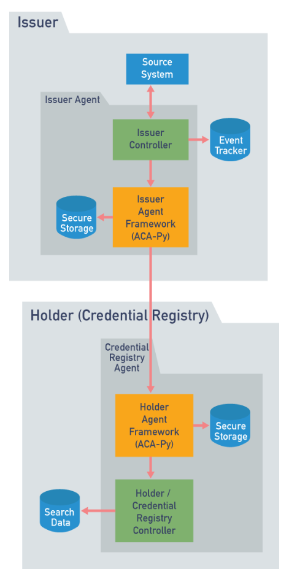
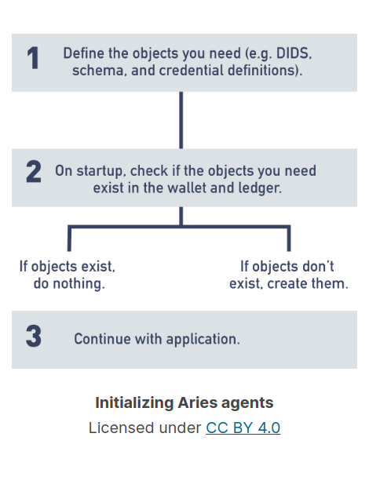

# Horizontal Scaling

For enterprise Agents, it's important to consider scaling. While your environment may start out small, you need
to think about your ability to scale up capacity as your use case grows and you need to add more agent instances.

## OrgBook BC example

ORgBook BC is a service run by the Digital Identity and Trust team at the Government of British Columbia. It uses
a **Verifiable Credential** flow to publish data about all registered legal entities in BC. When OrgBook BC was 
initialized, an Aries issuer issued millions of credentials to an enterprise holder as quickly as possible.
This volume required the scaling of the solution to use a lot of processing power.

The architecture can be summarized with the following bullet points:
- ACA-Py is depicted in organge boxes
- Controllers are green
- Blue database symbols are secure storage. They hold keys, ledger data, connections, credentials and protocol state objects
- Issuer controller does the following:
  - Monitors the source system for "events" that trigger credential updates
  - Tells it's ACA-Py instance to issue verifiable credentials to the Credential Registries using [https://github.com/hyperledger/aries-rfcs/tree/main/features/0453-issue-credential-v2](RFC 0453)
  - Controller keeps track of processed events and issued credentials in the Event Tracker database
- The holder's **ACA-Py framework** receives credentials, stores them in agent secure storage and notifies controller
- The holder's **controller** extracts claims from credentials and stores some in search database.
- HTTP is used for transport between all controllers and ACA-Py instances
- All databases are PostgreSQL instances

### OrgBook design

The design looks pretty straightforward and the operation is rather simple. Use Aries protocols to connect
two agents and issue credentials from issuer to holder. The challenge was the sheer amount of credentials 
being issued. It was required to issue 2.5 million credentials as quickly as possible. Ideally within a few
hours. After this credentials would need to be issued at a steady pace of a few thousand per week.
Therefore, the system should be **scaled up for the initial burst** of credentials, and then scaled down to keep 
a steady, lower amount going.

### OrgBook is a bit different

The OrgBook use case is a bit different compared to what a typical Aries solution would look like. Normally
an issuer would connect with a multitude of holders to then issue credentials to each, instead of just one holder.
Both cases have a need for horizontal scaling, so this fact remains the same.

For a scenario like this you'd want to run the application on a platform supporting scalability. Some thing like
Kubernetes would support automated horizontal scaling. As the load increases, more containers are added to temporarily 
increase issuing capacity. 

### Auto Scaling

To enable auto scaling, the implementation should be approached cloud native. In the case of Aries, this means
controllers and agent framework components should be stateless (operating without holding state in memory). The multiple
framework and controller instances would operate as a single logical agent, combining the capability of all the 
agents looking to the outside world as a single agent.

All agent frameworks would save their data in a single secure storage. Ideally that database is implemented as 
a cluster, so it's also highly scalable. The scalable controllers would likely have their own storage as well, separate 
from Aries secure storage.

To make Aries components stateless, event state should not be held in memory, but should instead be persisted to shared storage after
the completion of events. With that, any number of agent instances can wait on events, retrieve state and process it.
Since all transports likely go via HTTP, load balancers can be run in front of the components to distribute load.

### Frameworks built with scaling in mind

Frameworks like ACA-Py are built with scaling in mind. Always keep scaling in mind when building a controller.
Define a clean controller that retrieves state from a shared storage at the start of processing events and writing 
state to shared storage at the end.

## Making ACA-Py Stateless
ACA-Py itself is not yet ready to be stateless. It uses an in memory queue that processes requests that can 
not be handles immediately. When the agent is shut down those requests would be lost. 

Work has gone into making ACA-Py stateless like making a scalable ACA-Py cluster using persistent queue en 
shared caching techniques, but this is still a work in progress. 

For most use cases, deploying a horizontally scaling instance of ACA-Py on Kubernetes is sufficient. It's best
to over provisioning with containers so containers handle light loads. This minimizes the impact of one container
shutting down. 

## Agent Instance Initialization
Managing the initialization of instances must be managed properly, particularly when it comes to writing
objects to the ledger.

One approach (although a little naive) might be this

It might work in most cases, but what if multiple agent framework instances start up in parallel. Both will do
step 2 at the same time and see that there are objects missing on the ledger and create them both.

ACA-Py addresses this by having agents run in one of two modes: **provisioning** and **operational**. In provisioning
mode, the agent starts up, checks if all the required recourses have already been provisioned and if not, creates them.
This includes things like creating and initializing secure storage, creating required ledger objects and writing
them to the ledger.

In ongoing operation, **operational mode** is used. The agent will start up and check if all the necessary provisioning
has already been done. If it hasn't, it will exit with an error, but if the provisioning has been done it will go off to
work like normal.

It is recommended to stick to this pattern when deploying agents. It allows for higher level permissions 
like creating secure storage database and writing to the ledger to be limited to provisioning agents. And running
agents with less 

### Exception for revocation

When having revocation enabled, operational agents would need to be able to write to the ledger, since they should 
be able to create new revocation registries.

### Learn more

To learn more about horizontal scaling, take a look at this link to the 
[BC Governments OpenShift Deployment Configurations repository](https://github.com/bcgov/orgbook-configurations).
This repository can give you guidance when deploying agents to a kubernetes platform.
