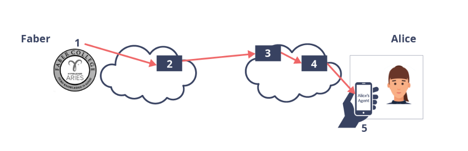

# Message Routing in Hyperledger Aries

## What is message routing?

### Why routing?
Based on the knowledge I've gathered so far, it's easy to form a mental image of how messages are 
being passes around between Hyperledger Aries agents. While messaging agents appear to be connected
directly. They ofter are **not**. Mediator and Relay agents are often necessary for messages to be
securely delivered.

The reasons for this are as follows:
- Mobile wallets do not have an endpoint. So other agents can not *directly* send messages to them.
- Entities might want to minimize correlation of their messages, so instead of having a unique endpoint, many agents
  might share the same endpoint. This way their messages are *hidden in the crowd.*
- Entities might not want inbound and outbound messages to be correlated. Therefore they might use different pahts for the two.
- An enterprise might want to have a gateway agent which is responsible for talking to the *big bad internet*. The other agents
  from that organisation will just talk to the gateway.

Only the *first* option in the list above is an actual requirement/fact. The rest are options available to the entities managing agents.



### Intermediaries/mediators
In the above example the Faber agent might decide to always send messages trough agent 2. Alice might
instruct other agents that they always want their messages to be sent trough agents 3 and 4. So in the end you
would need 5 agents in total to send a message from one agent to the other.

### Privacy
Faber and Alice probably want to keep their data private and will therefore encrypt the messages, with
only just enough information available for the intermediaries to know how to get the message to its destination.

### An analogy
You could imagine the routing agents as a sort of postal service. They get the message wrapped in multiple letters (encryption)
which are then sent to the receiver without them knowing the contents.

## DIDComm Mediators and Relays

### Mediator
In DIDComm, the **mediator** is an agent that the receiver has instructed the sender to use when sending them a message.
For each mediator that is being added to the *path*, another layer of encryption is added. Alice will
have a *list of agents*, that is actually just a **list of encryption keys** for Faber to use.

### Relay
In DIDComm, the term **relay** means that the message is being routed trough one or multiple agents, without knowledge of the sender.
Important difference with Mediators, is that the sender *must* know about those and explicitly add an extra *envelope* of encryption,
whereas for relays, they don't care. An analogy for a relay might be an assistant distributing letters in an organisation that have already been received securely.

### Mediators and Relays are agents too!
An important takeaway here is that both Mediators and Relays are agents of their own with all the functionalities that come with it.
It's just that their activities are different. They have a peer-to-peer relationship with the agents with which they communicate, and 
they use that channel to do **routing** on their behalf.

[Here you can see the RFC and more details on mediators and relays](https://github.com/hyperledger/aries-rfcs/blob/main/concepts/0046-mediators-and-relays/README.md)

## Encryption Handling
DIDComm encryption is performed within the Aries frameworks, and not something a developer building applications
that use an agent has to worry about. Within an Aries agent, there are libraries present responsible for encryption. And there is a big chance
that they eventually call some dependencies from **Hyperledger Ursa**.

To encrypt a message. The sender agent code will call something like a ```pack()``` function to encrypt a message. And to decrypt a message,
the code of the receiving agent will call something like an ```unpack()``` function.

The *encryption envelopes* described in the following RFC's 
([RFC 0019](https://github.com/hyperledger/aries-rfcs/blob/main/features/0019-encryption-envelope/README.md) for AIP 1.0) 
([RFC 0587](https://github.com/hyperledger/aries-rfcs/tree/main/features/0587-encryption-envelope-v2) for AIP 2.0)
define the different variations for sender authenticated and anonymous encryption. 

### Authenticated messages
Both the keys for the sender and the recipient are used for encryption. The recipient will know exactly who sent a message.

### Anonymous encryption
With **anonymous encryption**, the sender will only use the public key of the recipient for encryption. Anyone who knows that key can send a message.

In DIDComm, the general way to go would be **Authenticated** messages, and it's generally used for all messaging that involves a sender and recipient.
**Anonymous encryption** is often used for messages to and from **Mediators** and **Relays**

## Mediators, Relays and Privacy

It should be obvious that when sending messages trough other agents, some privacy aspects need to be taken into consideration. It's tempting 
so keep sending and handling messages as simple as possible, but for privacy reasons that might no be a very good idea. Below you'll find some notes on how **DIDComm** can **mitigate** privacy risks

### Recording Metadata