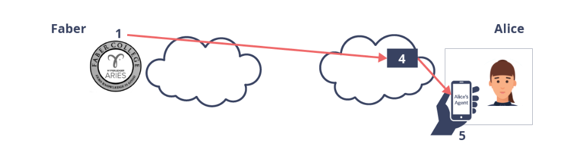
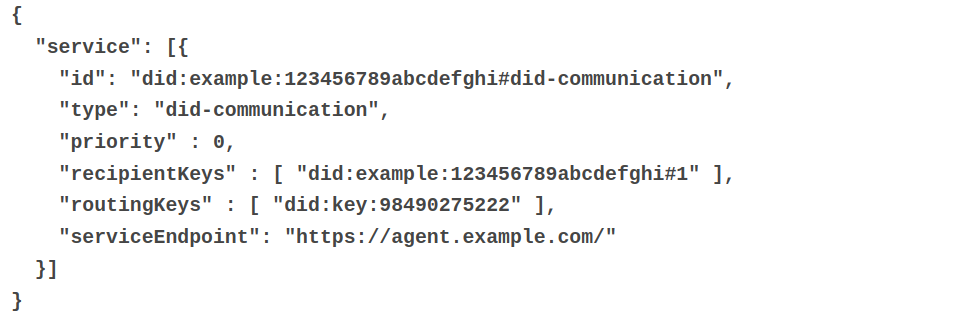
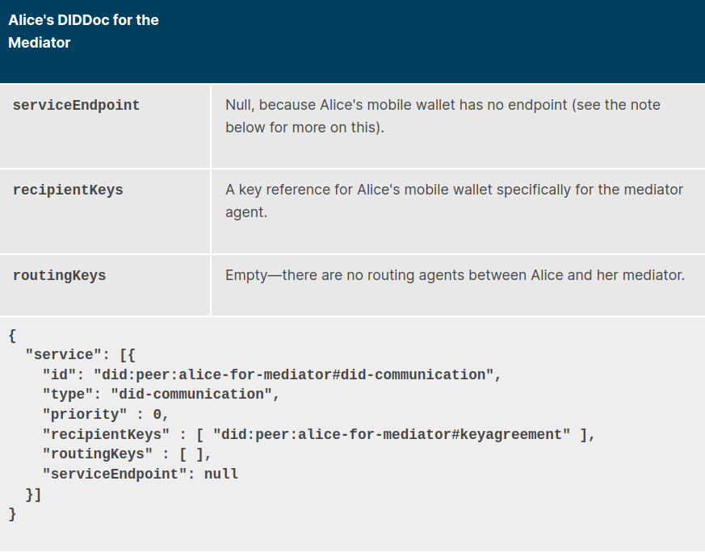
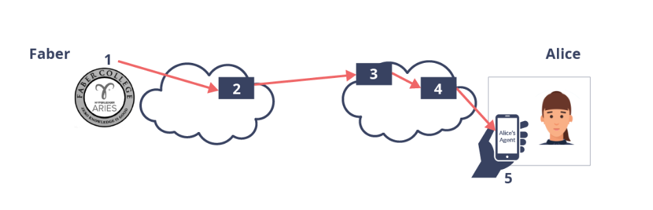

# Mobile Wallets and Mediators

While routing is an important thing to understand about DIDComm and Aries in general. For mobile
wallets, mediators and routing is a requirement. Other agents cannot send data **directly to mobile 
wallets**. A mobile wallet MUST have a mediator agent trough which inbound messages flow.

If you're thinking about deploying a mobile wallet, you must also thing about how you'll deploy a cloud 
based mediator agent.

## Mobile Wallet Mediator Scenario

This example will have the enterprise Agent Faber establish a connection with Alice, who is using
a mobile wallet. The creator of Alice's mobile wallet has deployed a mediator that is used by all
mobile wallet apps installed on their customers phones.

DIDs and DIDDocs are generated by each participant for each relationship that is going to be made.
- Alice for Faber
- Faber for Alice
- Alice for the mediator
- Mediator for Alice

### Routing perspective

In the routing perspective, the most important information in the DIDDoc is the following:
(Remember that the DIDDoc is what you get when you resolve a DID)
- The public keys for routing agents
- A service element of type did-communication including:
  - **serviceEndpoint**
  - **RecipientKeys:** array of keys for the target(s) of the message
  - **routingKeys:** array of referenced keys for the mediators trough which the message should go

Below is an example of how such a service element could look like. For this scenario, as you can see, 
there is one recipient and one mediator.

Below there is an example for how Alice's DIDDoc for the mediator agent could look like. Notice
the **serviceEndpoint is null.**

As discussed before, the server has no way to directly send data to the mobile app and the mediator
is no different. So how does the wallet get messages from the mediator? For this, Aries wallets commonly
use either of these two techniques:
- Web Socket: This is the most common technique, which allows mediator and wallet to exchange messages 
  so long as the connection is open.
- Transport Return Route: Mediator puts DIDComm messages into the response of an HTTP request from the wallet.

The flow is the same regardless:
- No connection to the wallet? Mediator queues up messages intended for the wallet.
- Wallet uses either web socket or DIDComm return route to initiate connection
- Whilst connection is open, the mediator will send the queued up messages to the wallet.

### Alice's DIDDoc for Faber
Here we're going to step trough the events that happen when Alice and Faber first connect so that 
Alice's agent can construct the service element to send to Faber
- Initializing Alice and the mediator
- Connecting to Faber
- Completing connection

Before Alice can connect to Faber, Alice's wallet needs to set up her inbound routing using the mediator
and thus establishes a DIDComm connection to the mediator. The protocol for creating a mediating relationship
is the following ([RFC 0211](https://github.com/hyperledger/aries-rfcs/tree/main/features/0211-route-coordination))

The protocol has a few important messages:
- **mediate-request:** Agent asks mediator to provide mediating services
- **mediate-grant**: Mediator agrees and provides key reference that the requesting agent can put in the **routingKeys** array.
- **keylist-update**: Mediator maintains routing table to know what to send where. As it receives messages, 
  it will look up the key from the message and deliver the message to the corresponding wallet.

Alice agent and Mediator establish relationship as follows.
- Alice's mobile wallet connects using DIDComm to the mediator agent.
- Alice's mobile wallet sends a mediate-request to mediator agent.
- Mediator agrees (or disagrees) and sends back a mediate grant message with public key and endpoint for mediator.
- Alice will use the public key from mediator in DIDDocs for connection to other agents (e.g. Faber).

*As mentioned previously, either web sockets or Transport Return Route protocol is used to get messages from mediator.*

### Connecting to Faber

Let's assume Alice's wallet gets a connection invitation from Faber (QR code/email). The steps Alice
needs to follow to prepare her side of the connection are as follows:
- Generate a new DID for Faber
- Prepare and partially complete a DIDDoc including public keys she will use when sending messages.
- **serviceEndpoint** is (usually) the mediator endpoint.
- **recipientKeys** array is filled with a DID containing Alice's public key(s) for Faber
- **routingKeys** is filled with DID referencing the public key Alice got from her mediator agent
- Before sending response, Alice lets the mediator know that messages using the new **recipientKeys** should be sent to Alice
- To accomplish this, Alice sends a **keylist-update**, so the mediator will update it's routing.
- Faber, upon receiving the DIDDoc resolves the DIDs and the mediators endpoint will be put in the 
  **serviceEndpoint** value in the Alice-for-Faber DIDDoc  

### Completing connection

With the DIDDoc Alice created for Faber now being ready, Alice uses the endpoint Faber provided in
their invitation to send a **connection-request** message to Faber with the new DID and DIDDoc.

Faber will now know how to get any message to Alice securely. When Faber sends a message, they use 
the information from the DIDDoc to securely send the message to the mediator, from which it's retrieved
by Alice. The connection has been made.

Steps for Faber to send a **DIDComm** message to Alice:
- Prepare message for Alice's wallet
- Encrypt and place into a *forward* message for Alice's mediator.
- Send message to **mediator endpoint**.

### Adding more Mediators and Relays

With the additional knowledge gained from the information before, let's now take a look at this 
scenario again.

Faber uses an outbound mediator to send messages. Alice's wallet uses agent 3 as an agency endpoint
and agent 4 as a mediator as discussed in the previous section. When all connections are established, here is what happens:
- Faber's wallet prepares and encrypts message for Alice's wallet.
- Faber's agent encrypts and places message into a **forward message** for Alice's mediator.
- Faber's agent encrypts and places message into **forward message** for Alice's agency endpoint mediator
  (Remember the **multiple envelope** analogy discussed earlier)
- Faber encrypts and places message into **forward message** Faber's outbound mediator
- Faber actually **sends** the message to it's outbound mediator's endpoint.
- Fabers outbound mediator decrypts message and using the **"to"** address, sends it to Alice's agency endpoint.
- Agency mediator decrypts message and using the **"to"** address, sends it to Alice's mediator.
- Mediator decrypts the message and sees from the **"to"** address that it's intended for Alice.
- If there is an active web socket connection, the mediator sends it to Alice directly, otherwise the message is queued up.
- Alice receives the message, decrypts it and processes it.

Why would Faber want an outbound mediator and Alice an agency mediator? **PRIVACY**.

If Faber's outbound mediator was used by many other agents, no one observing that mediator's traffic would know
who sent a particular message. Same goes for Alice's agency endpoint. No one observing that would know for whom they
are destined.