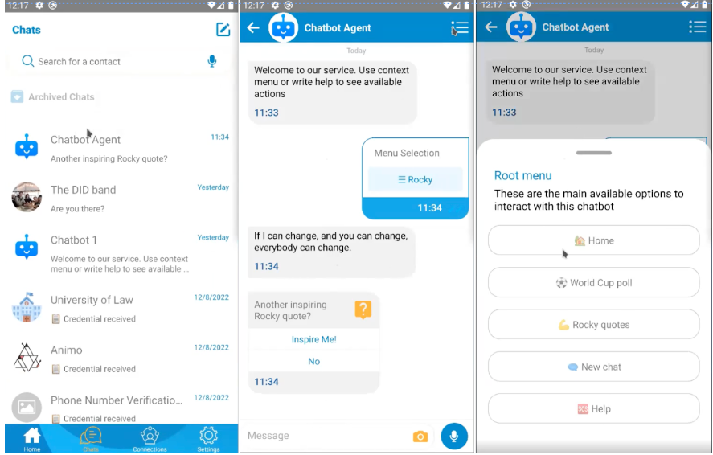

# Mobile Wallets
Aries Mobile Wallets offer all the functionalites that have already been talked about. They are an Agent like any other.
They can establish connections, exchange credentials etc. Since wallets are more focused towards 
people, the typical use case for them would be to be a credential holder. That would mean the main functionalities
will be receiving credentials, requesting and presenting proofs.

## Core Capabilities of Aries Mobile Wallets   
- Some kind of toturial to help the user get used to the functionalities of the wallet.
- Mediator connection is established (automatically or with some user input)
- If the wallet is secured with biometrics, this is done entirely on the device. Biometric is not accessible to anyone.
- Big button with option to scan QR-code, which is the favored method to establish a connection.
- Once connection is established, messages and presentation requests etc can be sent.
- Once the connection is made it won't have to be re-established

## Credentials and Connection Lists
There is an ongoing debate of whether the main focus of apps should be to show **Credential/connection** 
lists or not. The internal framework already knows which connection is asking for something and users
dont have to scroll trough their contacts themselves. When a request for proof is received, the internal
framework also looks through the available credentials automatically, finds the credentials and asks
the user for confirmation for sending the proof.

The current focus for **Credential and Connection** lists is to just get a **history** of both. The user will
be able to see **when** a connection was established and what interactions occurred with it. When a **credential** was
received, **when** it has been used and **what** it has been used for.

**Scanning QR-codes** is the **main** focus, **credential and connection** list information comes **second**.

## Credential Types and Ledgers
To this point, all Aries mobile wallets use AnonCreds credentials and a Hyperledger Indy ledger. This is mainly because of the
following reasons:
- Aries' roots lie in Indy.
- Those technologies offer a lot of privacy preserving features.
- AnonCreds are easier to use from a business and developer perspective.

AnonCreds are easy to use because compared to other credentials, AnonCreds make a lot of decisions
about how issuers, holders and verifiers interact that would otherwise have to be implemented manually.

For wallets working with Indy, wallet deployments will need to decide what Indy ledgers to support. The most 
common approach is to just support some **test ledgers** that developers are most likely to use and **production ledgers**
that are most likely to be used by customers.

## Beautiful credentials
When technology matures, there are going to be more requests for features that make the technology more attractive
to the general public. One such feature is making credentials more **"beautiful"** in wallets. Organisations
want to create make their credentials match their **brand** and display the info withing it in the user's native language.

There shouldn't be any **Techno babble** on display that could confuse the user. The answer of the Aries community
is called the [Overlays Capture Architecture (OCA)](https://humancolossus.foundation/blog/cjzegoi58xgpfzwxyrqlroy48dihwz). This allows issuers to convey the following in their credentials:
- The name and the description of both the credential and the issuer in multiple languages.
- Help/support information about the credential in multiple languages.
- Links to website pages with issuer info/support about the organisation and credentials.
- Labels and information about each claim/attribute in the credential.
- The data type and format of each claim in the credential so holder and verifier can properly render the item
- Branding elements so issuers can convey their brand. (images, colours, backgrounds, logo's)

Below you'll find an example of a credential without (left) and with (right) OCA support.

## Advanced Chat feature
Another powerful by product of mobile wallets are Advanced Chat features. Nowadays trust in communication
is almost completely zero (think about clicking on links in emails being sent). So there is demand for a 
secure channel of communication.

**DIDComm** can be used to bring that trust back. The following examples could be use cases for such secure messaging:
- Driver's license authority sends you a message that it needs to be renewed.
- Your bank sends you a message about something that went wrong with your credit card (fraud, stolen)
- A user could initiate a message themselves with a question that only the issuer should see, and they can immediately confirm
  that it's really you who sent it.

## Action menu feature
Action menu is basically just a contact sending a list of options to another user, with the user on the receiving end
picking an answer and triggering some kind of event.
