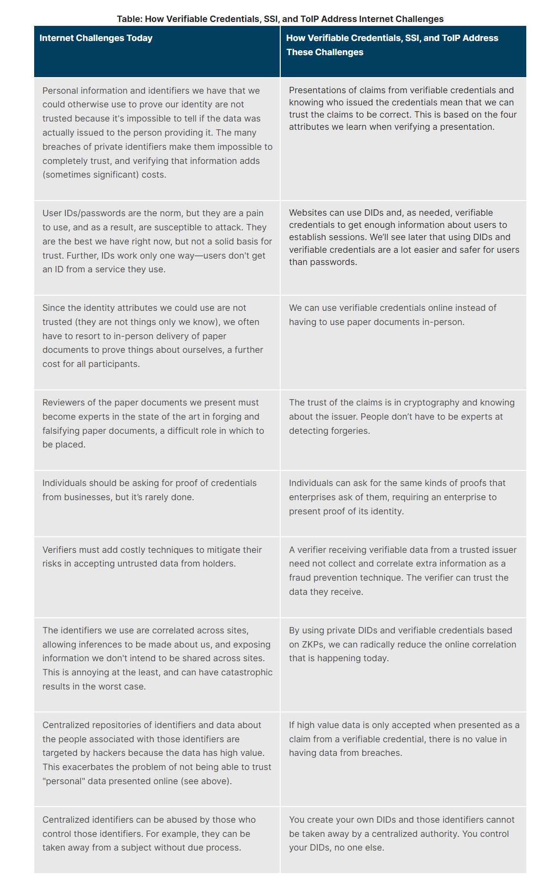

  
ref: The verifiable credentials model By Peter Stokyo (Licensed under [CC BY 4.0](https://creativecommons.org/licenses/by/4.0/)) (Peter Stokyo, 2023)

;
Sovrin.org, (2023). 12 principles of SSI. Sovrin Foundation. https://sovrin.org/principles-of-ssi/ text: (Sovrin Foundation, 2023)

learning.edx.org - LinuxFoundationX (2023). How Verifiable Credentials, SSI, and ToIP Address Internet Challenges https://learning.edx.org/course/course-v1:LinuxFoundationX+LFS172x+1T2023/block-v1:LinuxFoundationX+LFS172x+1T2023+type@sequential+block@e5cc114baa084d9d8004294a102c7d3f/block-v1:LinuxFoundationX+LFS172x+1T2023+type@vertical+block@0b5c850c5f804f86a2f1ec45f63d797e
