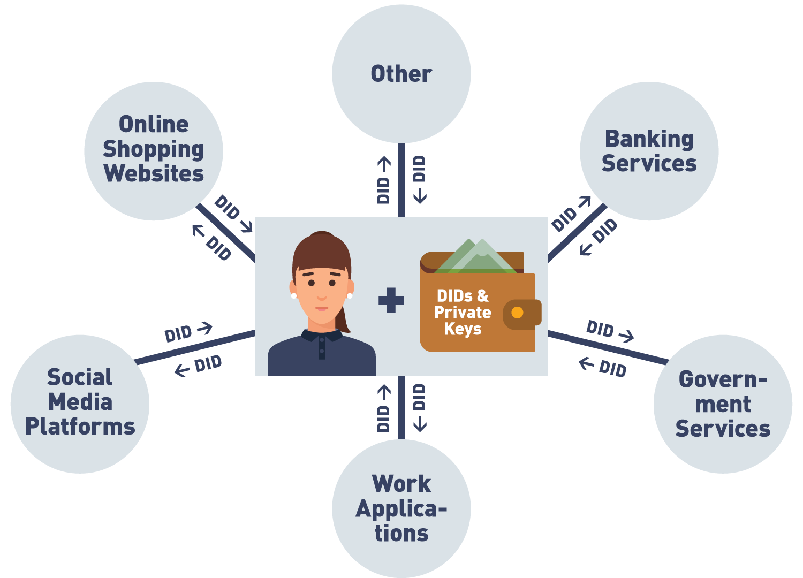

# What are DID's

The concept of Verifiable Credentials wouldn't be possible without Decentralized Identifiers. Decentralized identifiers
are a new type of identifier that enable your identity to be verifiable and decentralized. A DID could represent pretty much
anything. A person, a thing, a data model or an organisation as a whole. What it represents is determined by the controller 
of the DID.

- A DID can be created by anyone. People, organisations and things can create DIDs. In some cases the creator can update the 
  DIDDoc contents that are returned when their did is resolved. 
- Each DID is globally unique, as long as the rules for properly generating a DID are followed.
- DIDs are highly available. They can even be available when a few servers are down, because they are often resolved from 
  a distributed ledger. The underlying blockchain technology should make sure that many copies of that ledger exist on servers
  all over the world.
- DIDs are cryptographically verified. Control over a DID can be proved by asking the DID controller for the private key that 
  is linked to the public key in the DIDDoc

## With a DID you can:
- Resolve the DID to see what's in the DIDDoc
- The DIDDoc will contain a public key and possibly also an endpoint for the entity that controls the DID
- The endpoint should be usable for sending messages
- In the message you can ask for proof that they have the private key for that DID
  - Just responding to the message is enough, as they wouldn't be able to decrypt it without a private key
  - One possibility of a message could be a request for presentation of a verifiable credential
- Receive and verify proof

## From a business perspective
DID is an identifier that can be created and shared by **you**. Identifiers that we normally use every day are created and/or
controller by someone else. Only the holder of a DID's private keys can "delete" a DID, but a DID on a blockchain can never 
be deleted as all information on a blockchain is permanent. Deleting it in that case would just mean no longer responding to any
requests that are made using that DID.

Knowing the identity of the issuer is easy due to the nature of how DIDs work. The verifier could either know the issuer can 
be trusted because they are part of some hard coded list the verifiers agent manages, or they could check an external list
often known as a "trust registry". Another approach could be resolving the DID and using the DIDDoc to connect to the issuer
and ask for identity data related to the did holder. 

### DIDs are non-correlatable
The identifiers we use today are often reused in many different places on the internet. With DIDs, the fact remains that we 
are able to create our own. This means that you don't need to have just one DID, but you can make multiple. The philosophy behind
the SSI model is that you have one DID for every relationship that you have on the internet. Both sides of the relationship provide
a DID that the other entity should use to interact with them.
  

Instead of creating a username/password relationship, you create a DID/DID relationship that works both ways with the target platform.
This eliminates the need for usernames and passwords entirely

### Public and Private DIDs

A public DID is one that is visible to anyone. Anyone would be able to see it, resolve it to obtain the DIDDoc and make contact
with the one who owns it. The public nature would in this case mean that the DID is rather correlated, which in this case 
is not necessarily a bad thing. Larger organisations like a company or the government are more likely to use public DIDs, because
they are often issuers of DIDs as well. Since a holder of a credential may present it to anyone, the identity of the issuer will 
be in the credential as a public DID. This makes it possible for the verifier to investigate the issuer if necessary. 

Private DIDs are more applicable to a use case where it's just two or several entities that want to interact with each other.
In this case only those parties should be able to resolve the DID and other parties should not be involved. In this case **Private DIDs** are used.
The DIDs are not published on the blockchain, but instead the parties involved create the DIDs and send them to the target directly. Any updates are 
also directly sent to the target. No one else can see it.
The advantages of private DIDs can be summarized like so:
- Security: Not exposed to a public ledger, reduce chance and surface area of potential attacks
- Privacy: Not published to ledger so suitable for situations where information needs to be kept from public eye
- Cost: Writing to a blockchain is expensive, so you would want to avoid it when it's not necessary.
- Closed systems: Private DIDs are ideal for use cases where identity verification needs to occur in a defined and closed ecosystem (consortium)